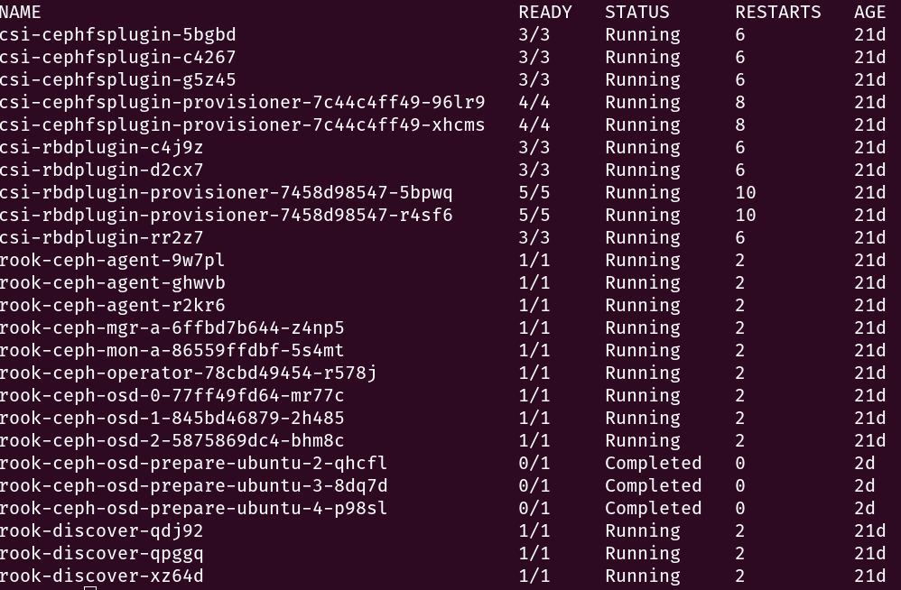
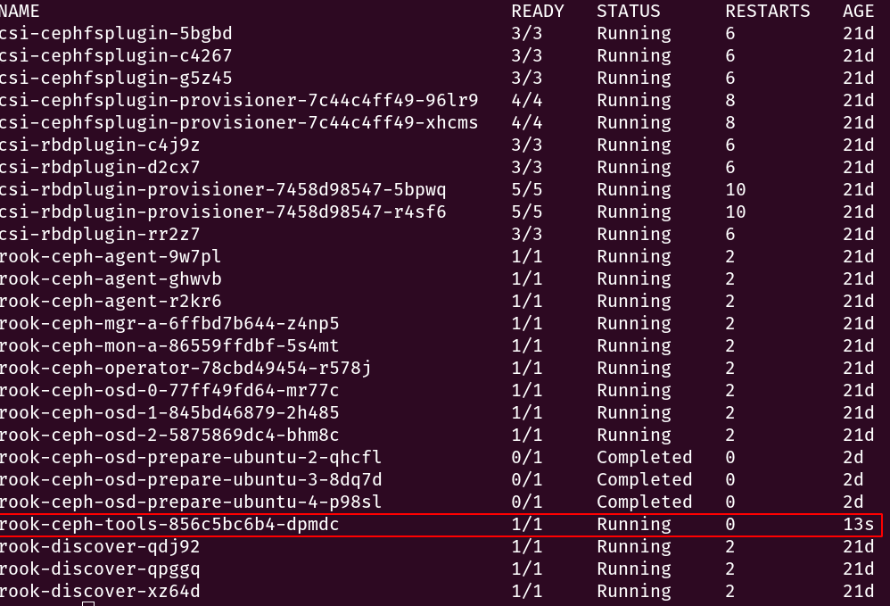
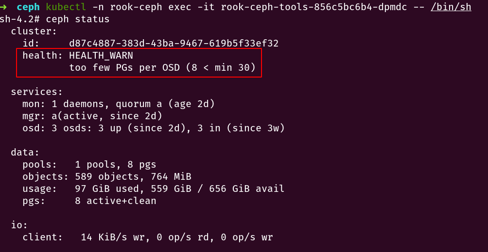

# `Ankr`  Install `Ceph` Cluster Cookbook

**Warning**

>  The default disk which mounted path is /var/lib/rook. if a new `ceph` cluster need to mount the other disk, 
>
> there are two solutions, the one is mount the new disk to /var/lib/rook directly. the other is modify the default disk directory , 
>
> that's refer to the value of `spec.dataDirHostPath` in `cluster.yaml`

**step 1: install common and operator** 

```bash
kubectl apply -f  common.yaml
kubectl apply -f operator.yaml
```

**step 2: deploy `ceph` cluster**

```bash
kubectl apply -f cluster.yaml
```

step 3: check cluster status

```bash
kubectl  -n rook-ceph get po
```

**the below is output in `K8S` cluster which has three work nodes**



**step 4: install tool box for inspect the cluster status**

```bash
kubectl apply -f toolbox.yaml
```

**check tool box deployment status**



**check `ceph` cluster deployment status**

```bash
kubectl -n rook-ceph exec -it rook-ceph-tools-856c5bc6b4-dpmdc -- /bin/sh  
ceph status
```

**output:**



**memo:**

> ​	the figure shows health is warning status,  if the `ceph` cluster is OK, it should show `HEALTH_OK` status

**step 5:  create default storage class**

```bash
kubectl	apply -f sc.yaml
```

**step 6: check storage class status**

```bash
kubectl get sc
#output
NAME                        PROVISIONER          AGE
rook-ceph-block (default)   ceph.rook.io/block   10s
```

