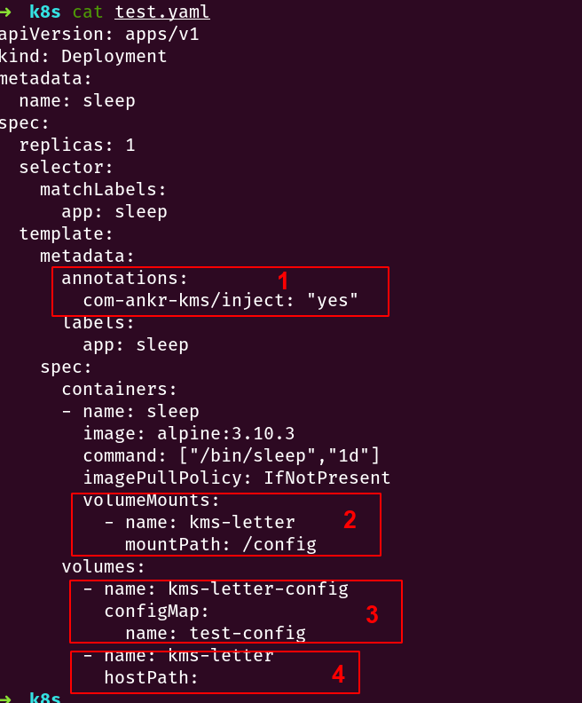

# `Ankr KMS INSTRUCTION`


## `What is KMS`

> The `Ankr KMS`  origins problem domain which includes save static secrets and dynamic secrets.  the static secrets contains service's configuration information, encryption key, decryption key and so on, these information are usually not change but it's very sensitive and secret, so they should be saved in the `KMS`.  the other important part, dynamic secrets, it contains token generate(such as database access token generate), `PKI` service, `EaaS`(Encryption as a Service) and so on.


## `How to Use KMS`

- Part I: The Static Secrets

  1. save the static secrets into `KMS`

     > we supply two ways to solve this problem, the one is do it with our web manger system, the other one is do it with our official `SDK` 

     - the below example is `SDK` way, the doc address is  [here](https://godoc.org/github.com/Ankr-network/go-kms).

     ```go
     const (
     	operaterAddr = "http://192.168.1.92:30386"
     	vaultAddr    = "http://192.168.1.92:30050"
     )
     // operaterAddr is remote kms operator service ,the default port is 8080
     // vaultAddr is remote kms vault service, the default port is 8200
     // ankr-sms is the app role name, the way take it on the web manager system or connect to us
     kvc, err := NewKVer(operaterAddr, vaultAddr, "ankr-sms")
     if err != nil {
     	...
     }
     // hello is the store path
     // map[string]string{"hello": "world"} is the data
     if err = kvc.Put("hello", map[string]string{"hello": "world"}); err != nil {
        ...
     }
     ```

     - the web manager system is coming.

  2.  get the secrets from `KMS`

     - one can take it with `SDK`, the example code as the below shows

       ```go
       const (
       	operaterAddr = "http://192.168.1.92:30386"
       	vaultAddr    = "http://192.168.1.92:30050"
       )
       kvc, err := NewKVer(operaterAddr, vaultAddr, "ankr-sms")
       if err != nil {
       ...
       }
       rsp, err := kvc.Get("hello")
       if err != nil {
       ...
       }
       // output:
       // {"hello":"world"}
       ```

       -  one can take it  with `kms messenger service`, this way is a little complicated, please focus to read it, thank you.

         > this way origins the service entity which inject secrets into it's internal specify path automatically. 
         >
         > the service entity should run in the `Kubernetes` cluster
         >
         > well, please follow steps and do it step by step.

         step 1:  prepare the secret configuration file, which contains secrets path in the `KMS`, 

         ​				example configuration `yaml` file as below shows: 

         ```yaml
         # test-config.yaml
         appRole: ankr-user
         secrets:
           - name: /
             value: root
           - name: hello
             value: hello
           - name: world
             value: world
         ```

         configuration file instruction:

         > `appRole` is the `app` role, all mostly, one service entity has one or many `appRole`, but recently we only support one `appRole`.
         >
         > part secrets, name specify secrets path in the `kms`, value specify the configuration file in the service entity.

         now apply it in the `kubernetes` cluster, `DO NOT CHANGE CONFIGURATION FILE NAME` 

         ```bash
         kubectl create cm test-config --from-file=test-config.yaml
         ```

         step 2: configuration your service entity in the cluster

         > we assume you deploy a deployment type service

         the deployment configuration file as the below shows:

         

         configuration file instruction:

         > 1. part one annotation, please must label it and ``DO NOT CHANGE `.
         > 2. part two volume mounts, only can change part is the `mountPath` part, do not change the rest part.
         > 3. part three, only can change part is `configMap` part , name property . the name's value is configuration map
         >
         > object's name `test-config` ,which we create it in the step one
         >
         > 4. part four , do not change anything.

       - one can take it with the web manager system, but it's not ready yet.

     

- Part II: The Dynamic Secrets

  > this part instruction is coming.