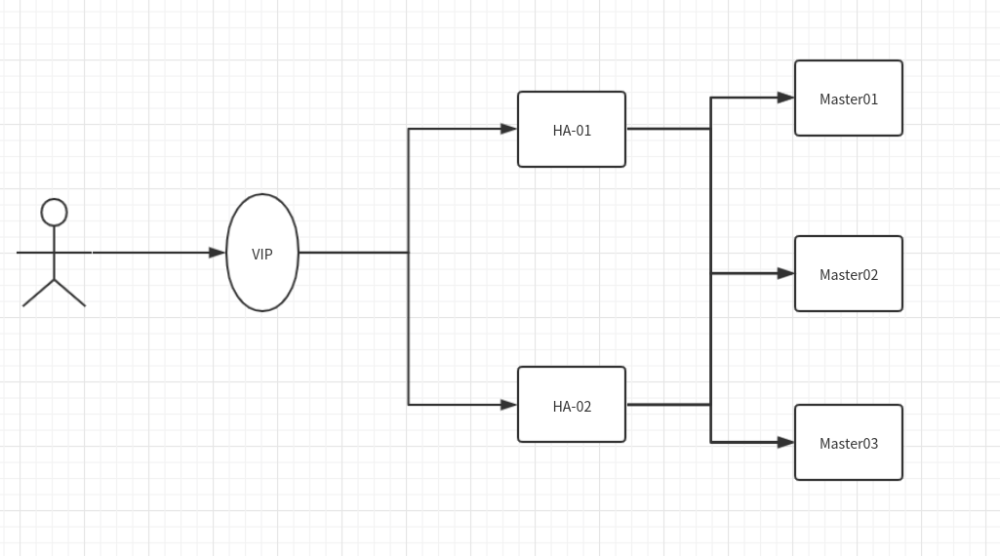

# kubernetes master高可用

**环境信息**

| master01 | 11.11.11.111 | master |
| -------- | ------------ | ------ |
| master02 | 11.11.11.112 | master |
| master03 | 11.11.11.113 | master |
| /        | 11.11.11.222 | vip    |

**架构图**



### 系统初始化

```bash
cat >> /etc/hosts<<EOF
11.11.11.111  master01
11.11.11.112  master02
11.11.11.113 master03
11.11.11.222 vip
EOF
```

**关闭selinux,防火墙**

```bash
setenforce 0
sudo sed -i 's/SELINUX=enforcing/SELINUX=disabled/g' /etc/selinux/config # 关闭selinux
systemctl stop firewalld.service && systemctl disable firewalld.service # 关闭防火墙
```

**修改系统时区,语言**

```bash
echo 'LANG="en_US.UTF-8"' >> /etc/profile;source /etc/profile #修改系统语言
ln -sf /usr/share/zoneinfo/Asia/Shanghai /etc/localtime # 修改时区（如果需要修改）
```

**性能调优**

```bash
cat >> /etc/sysctl.conf<<EOF
net.ipv4.ip_forward=1
net.bridge.bridge-nf-call-iptables=1
net.ipv4.neigh.default.gc_thresh1=4096
net.ipv4.neigh.default.gc_thresh2=6144
net.ipv4.neigh.default.gc_thresh3=8192
EOF
sysctl -p
```

**配置转发**

```bash
cat <<EOF >  /etc/sysctl.d/k8s.conf
net.bridge.bridge-nf-call-ip6tables = 1
net.bridge.bridge-nf-call-iptables = 1
vm.swappiness=0
EOF
sysctl --system
```

**配置免密登录**

master01:

```bash
ssh-keygen -t rsa //一路回车
ssh-copy-id -i ~/.ssh/id_rsa.pub root@master01
ssh-copy-id -i ~/.ssh/id_rsa.pub root@master02
ssh-copy-id -i ~/.ssh/id_rsa.pub root@master03
```

master02:

```bash
ssh-keygen -t rsa //一路回车
ssh-copy-id -i ~/.ssh/id_rsa.pub root@master01
ssh-copy-id -i ~/.ssh/id_rsa.pub root@master02
ssh-copy-id -i ~/.ssh/id_rsa.pub root@master03
```

master03:

```bash
ssh-keygen -t rsa //一路回车
ssh-copy-id -i ~/.ssh/id_rsa.pub root@master01
ssh-copy-id -i ~/.ssh/id_rsa.pub root@master02
ssh-copy-id -i ~/.ssh/id_rsa.pub root@master03
```

## 部署keepalive+HAproxy

**master01 install keepalive:**

```bash
#centos
yum -y install epel-re*
yum -y install keepalived.x86_64 
#ubuntu
apt install -y libssl-dev  openssl libpopt-dev
apt install -y keepalived
#配置keepalived
cat > /etc/keepalived/keepalived.conf <<-'EOF'
! Configuration File for keepalived

global_defs {
   router_id k8s-master01
}

vrrp_instance VI_1 {
    state MASTER
    interface enp2s0
    virtual_router_id 51
    priority 150
    advert_int 1
    authentication {
        auth_type PASS
        auth_pass zsf
    }
    virtual_ipaddress {
        11.11.11.222
    }
}
EOF
systemctl enable keepalived.service && systemctl start keepalived.service
```

**master01 install HAproxy:**

```bash
#centos
yum -y install haproxy.x86_64
#ubuntu
apt install -y haproxy

cat > /etc/haproxy/haproxy.cfg <<-'EOF'
global
        chroot  /var/lib/haproxy
        daemon
        group haproxy
        user haproxy
        log 127.0.0.1:514 local0 warning
        pidfile /var/lib/haproxy.pid
        maxconn 20000
        spread-checks 3
        nbproc 8
defaults
        log     global
        mode    tcp
        retries 3
        option redispatch
listen https-apiserver
        bind 192.168.1.16:8443
        mode tcp
        balance roundrobin
        timeout server 15s
        timeout connect 15s
        server apiserver01  11.11.11.111:6443 check port 6443 inter 5000 fall 5
        server apiserver02 11.11.11.112:6443 check port 6443 inter 5000 fall 5
        server apiserver03 11.11.11.113:6443 check port 6443 inter 5000 fall 5
EOF
systemctl start haproxy.service  && systemctl enable haproxy.service
```

**master02 install keepalive:**

```bash
yum -y install epel-re*
yum -y install keepalived.x86_64 
cat > /etc/keepalived/keepalived.conf <<-'EOF'
! Configuration File for keepalived

global_defs {
   router_id k8s-master02
}

vrrp_instance VI_1 {
    state MASTER
    interface enp2s0
    virtual_router_id 51
    priority 100
    advert_int 1
    authentication {
        auth_type PASS
        auth_pass zsf
    }
    virtual_ipaddress {
         11.11.11.222
    }
}
EOF
systemctl enable keepalived.service && systemctl start keepalived.service
```

**master02 install HAproxy:**

```bash
yum -y install haproxy.x86_64
cat > /etc/haproxy/haproxy.cfg <<-'EOF'
global
        chroot  /var/lib/haproxy
        daemon
        group haproxy
        user haproxy
        log 127.0.0.1:514 local0 warning
        pidfile /var/lib/haproxy.pid
        maxconn 20000
        spread-checks 3
        nbproc 8
defaults
        log     global
        mode    tcp
        retries 3
        option redispatch
listen https-apiserver
        bind 192.168.1.16:8443
        mode tcp
        balance roundrobin
        timeout server 15s
        timeout connect 15s
        server apiserver01  11.11.11.111:6443 check port 6443 inter 5000 fall 5
        server apiserver02 11.11.11.112:6443 check port 6443 inter 5000 fall 5
        server apiserver03 11.11.11.113:6443 check port 6443 inter 5000 fall 5
EOF
systemctl start haproxy.service  && systemctl enable haproxy.service
```

**查看服务状态：**

```bash
[root@k8s-master01 ~]# ip a | grep "11.11.11.222"
    inet 11.11.11.222/32 scope global enp2s0
```

## 安装部署kubernetes 

### 添加kubernetes源

三台机器都需要执行：

```bash
cat <<EOF > /etc/yum.repos.d/kubernetes.repo
[kubernetes]
name=Kubernetes
baseurl=https://mirrors.aliyun.com/kubernetes/yum/repos/kubernetes-el7-x86_64/
enabled=1
gpgcheck=1
repo_gpgcheck=1
gpgkey=https://mirrors.aliyun.com/kubernetes/yum/doc/yum-key.gpg https://mirrors.aliyun.com/kubernetes/yum/doc/rpm-package-key.gpg
EOF
```

### 安装docker

```bash
yum install -y yum-utils device-mapper-persistent-data lvm2
wget -O /etc/yum.repos.d/docker-ce.repo https://download.docker.com/linux/centos/docker-ce.repo
yum makecache fast
yum -y install docker-ce
systemctl enable docker && systemctl start docker
```

### 安装k8s组件

```bash
yum -y install kubectl-1.16.0 
yum -y install kubelet-1.16.0 
yum -y install kubeadm-1.16.0
systemctl enable kubelet && systemctl start  kubelet
```

### 配置kubelet使用的cgroup驱动程序

```bash
echo 'Environment="KUBELET_CGROUP_ARGS=--cgroup-driver=cgroupfs --runtime-cgroups=/systemd/system.slice --kubelet-cgroups=/systemd/system.slice"' >> /usr/lib/systemd/system/kubelet.service.d/10-kubeadm.conf
```

#### 配置kubelet服务特权权限

```bash
echo 'Environment="KUBELET_SYSTEM_PODS_ARGS=--pod-manifest-path=/etc/kubernetes/manifests --allow-privileged=true --fail-swap-on=false"' >> /usr/lib/systemd/system/kubelet.service.d/10-kubeadm.conf
```

#### 设置docker镜像加速

```bash
cat > /etc/docker/daemon.json <<-'EOF'
{
  "registry-mirrors": ["https://tj7mo5wf.mirror.aliyuncs.com"]
}
EOF
```

**关闭swap分区**

```bash
 swapoff -a &&  sed -ir 's/.*-swap/#&/' /etc/fstab
```

### 配置kubeadm参数

```bash
cat > kubeadm-config.yaml <<-'EOF'
apiVersion: kubeadm.k8s.io/v1beta1
kind: ClusterConfiguration
kubernetesVersion: v1.14.0
controlPlaneEndpoint: 192.168.1.16:8443
imageRepository: registry.cn-hangzhou.aliyuncs.com/google_containers
networking:
  podSubnet: 10.10.0.0/16
EOF

kubeadm config images pull --config kubeadm-config.yaml #先把需要的镜像拉去下来
kubeadm init --config=kubeadm-config.yaml --experimental-upload-certs
```

按照提示操作，在操作kubectl的用户家目录下创建密钥

```bash
mkdir -p $HOME/.kube
sudo cp -i /etc/kubernetes/admin.conf $HOME/.kube/config
sudo chown $(id -u):$(id -g) $HOME/.kube/config
```

### 查看当前k8s的节点

此时有一台了，且状态为"NotReady"

### 查看当前启动的pod

```bash
kubectl get po -A
```

### 另外两台一master的身份加入集群

```bash
kubeadm join  11.11.11.222:8443 --token xxx
    --discovery-token-ca-cert-hash  xxx
    --experimental-control-plane --certificate-key xxxx

mkdir -p $HOME/.kube
sudo cp -i /etc/kubernetes/admin.conf $HOME/.kube/config
sudo chown $(id -u):$(id -g) $HOME/.kube/config
```

### 安装flannel网络插件

```bash
kubectl apply -f http://tools.zhangshoufu.com/tools/k8s/kube-flannel.yaml
```

**查看安装是否成功**

```bash
kubectl get no 
```

