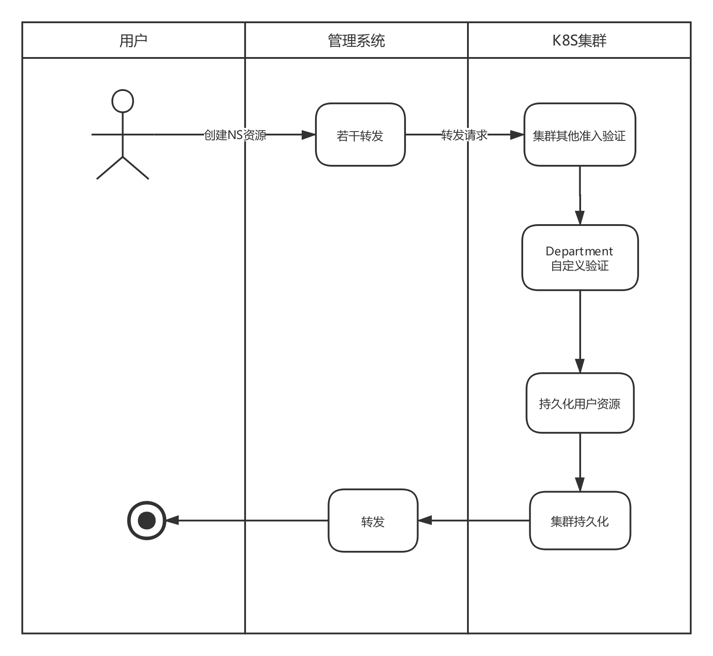
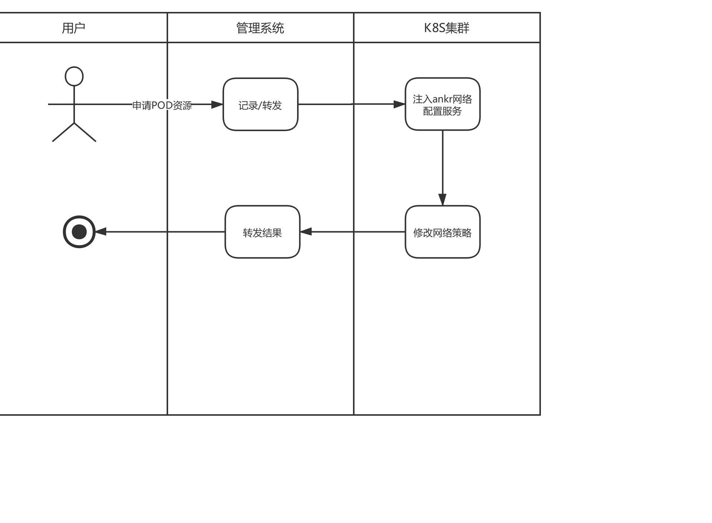

# 浅议K8S自定义逻辑分组方案

​																				——基于单一集群

author:   孙士才            date:        2019-09-11

## 问题域

​			在大多数情况下，为了简化维护K8S集群工作的复杂度，很多公司仅仅维护一个K8S集群，但又想保留原有的研发流程与环境，比如开发环境、测试环境、生产环境，而每个环境，又需要根据开发部门或者产品线再次进行分组，显然集群原有的逻辑抽象层次已不能满足这类需求，基于此，我们需要在集群原有的命名空间(Namespace)层与集群(Cluster)层之间，再抽象出一层以满足现实需要。

## 解决方案

​			当下江湖上能解决这类需求的方案或工具并不多，已经调研出来的解决方案有如下几种选择：

1、基于Istio实现逻辑隔离

​		这个方案需要实施者对Istio掌握程度至少应是娴熟，Istio各组件的功能定位，各项配置必须了然于胸才行，否则出了问题，处于干瞪眼的境地是尴尬的，如果生产环境也在一个集群上，那更是危险之极。

​		如果对Istio掌握程度已达生产标准，使用体验也不是很友好，每当一个逻辑研发组增加一个命名空间都需要调整一下这个研发组所有网络配置

推荐指数： 三星

2、基于Envoy网络代理

​			Envoy是一个网络代理组件，组件本身并不能实现问题域所提出的逻辑分组需求，需要以此为基础再进行一层逻辑封装才能满足需求，这个工作较于Istio来说，工作的重合度有点高，我们以此实现上层逻辑封装几乎可以肯定没有Istio做的好

推荐指数：两星

3、基于K8S原生网络策略(Network Policy)

​		此方案是K8S集群原生网络策略方案，操作简单，上手容易，但维护成本略高，需要底层网络组件支持，对网络环境有要求

推荐指数：四星

4、基于K8S的扩展能力，自定义资源（CRD）

​		此方案需要一定的研发周期，有研发成本，但能彻底掌控，扩展方便，实施难度不大

推荐指数：五星

下文针对第四种解决方案做详细阐述。

### 约束

1、自定义一个叫Department的资源，该资源处于Cluster与Namespace之间

2、通过修改Department的资源创建定义模板来调整Department所有包含的Namespace

3、该Department资源所包含的Namespace网络都互通的，且Namespace之下的资源，如Pod，Service等必须保证是唯一的，不同Department的资源禁止通信

### 实现（不完整版）

实现方案总体描述：  扩展api-server，自定义一个api-server以实现用户资源申请核查，记录，注入功能，对于同一个用户申请多个NS，则需要记录，针对pod资源申请则需要注入一个私有服务，以动态发现和构建该pod网络策略

注：该方案尚未针对以空基础镜像为基础镜像的服务做测试，不过理论上可行

申请命名空间流程：

注： 用户信息通过标签传入，如：user:ankr

申请Pod资源流程：

# 总结

目前采用的实现方案，总体来说能满足业务需求，但不能彻底隔离用户工作空间，如果想要彻底隔离，就需要采用多集群的方案来满足需求了，但这就增加运维的复杂度