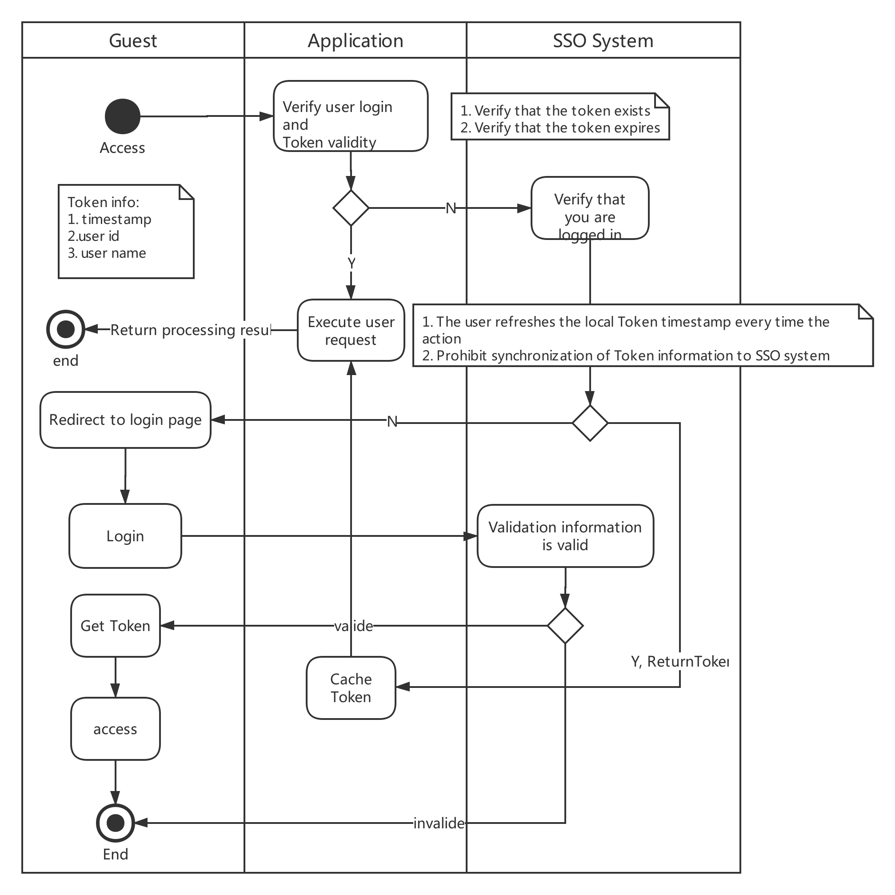

# 											`SSO Design Draft`

## `Problem Domain`

- Solve the problem of multiple manager system login

## `Constraint`

- Management of local user information, support for query, additions, deletions, and changes
- Support for third-party `SSO` authorization, such as `google`  `github` `twitter` and so on
- Support `OAuth2` authentication protocol

## `Solution`

The external system authorizes the interaction process, as shown in the following figure:

