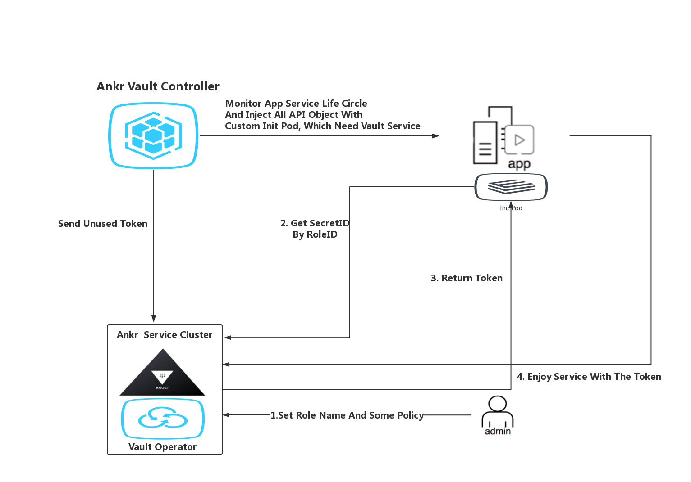

# Vault 应用方案 V3

**问题域**

略

**约束**

1. 复用Hashicrop公司Vault公开的接口
2. 保证用户使用简单方便

**解决方案**

流程图如下所示:

流程描述:

1.  客户管理员 访问 Ankr Vault Web管理界面, 配置**角色名**以及角色名对应的**访问策略**
2. 客户在K8S集群发布私有服务,并标注对应的**角色名**
3. 客户私有服务对象进入创建流程, 在客户服务对象创建流程中利用WebHook技术注入Ankr的Init Pod, Init Pod 与集群中的 Ankr Vault Controller交互,获取Token, 以固定的环境变量名或者文件的形式注入到客户的私有服务对象中
4. 客户私有服务对象创建完成后, Ankr Vault Controller会持续监控该服务对象的生命周期,根据用户角色配置策略及时刷新服务对象的访问Token
5. 客户服务对象持Token享用Vault带来的加解密服务以及机密信息的存取服务

**方案成果物**

1.  一个Operator服务 提供Vault服务更友好的WEB管理界面, 备份Vault落地的数据,清除无效的数据 如不再使用的token
2. 一个自定义的Controller 用于监控集群所有需要Vault服务的应用的生命周期
3. 一个Init Pod服务 用于初始化资源对象所需要的信息
